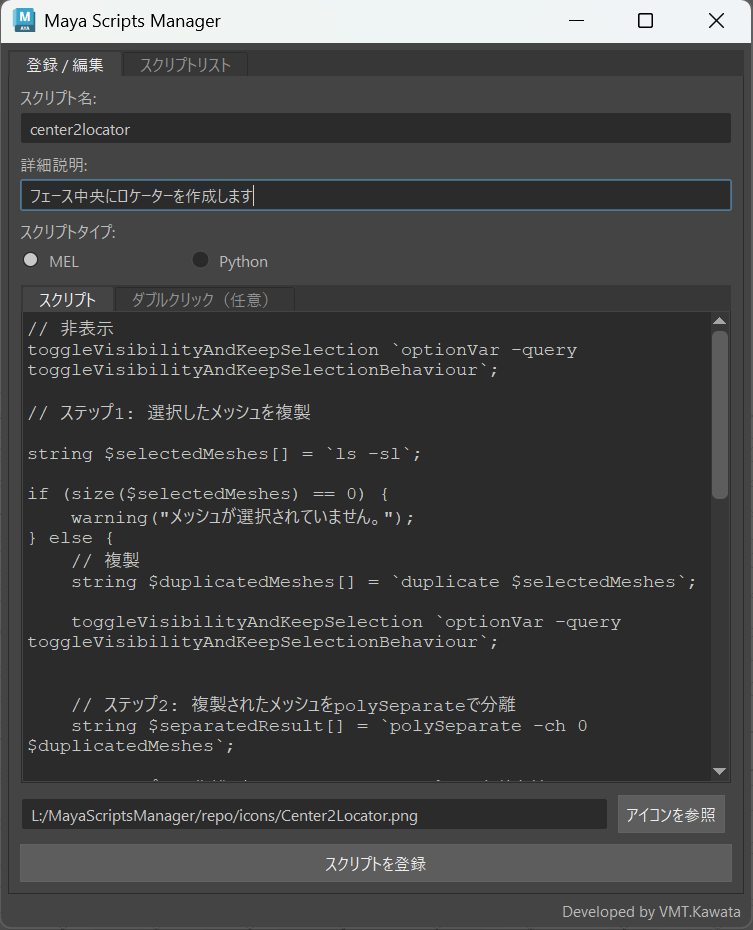
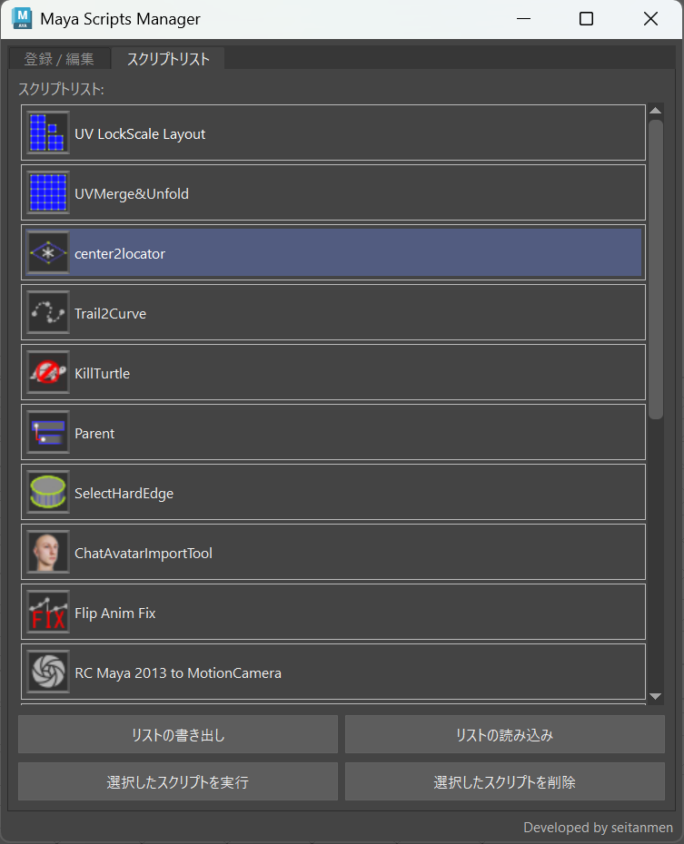

# Maya Scripts Manager

日本語 / [English](#english)

Maya 用の MEL / Python スクリプト管理ツールです。スクリプトを JSON に記録し、
UI 上での実行・シェルフへの追加・チーム間での共有ができます。
UI は日本語 / 英語に対応しています（自動判定、`.env` で切替可）。

- 登録時に **MEL / Python** を指定 → 実行・シェルフ追加時に自動選択
- **ダブルクリックスクリプト**対応（小タブで切替。シェルフボタンのダブルクリックで実行）
- **アイコン＋名前**の枠付きリスト表示
- ウィンドウのリサイズに追従する**レスポンシブ UI**（タブ構成）
- スクリプトリスト(JSON)の**書き出し／読み込み**による共有
- UTF-8 エンコーディング対応

---

## スクリーンショット / Screenshots

| 登録 / 編集 (Register / Edit) | スクリプトリスト (Script List) |
|:---:|:---:|
|  |  |

---

## インストール（ドラッグ&ドロップ）

1. 配布フォルダ（例: `L:\MayaScriptsManager`）をチームでアクセスできる場所に配置します。
2. **`DragAndDrop_Install.py` を Maya のビューポートへドラッグ&ドロップ**します。

これだけで、以下が自動で行われます。

- インストーラのある場所を基準に `.env` を生成／更新（`SCRIPT_REPO_PATH = <配置先>\repo`）
- 現在のシェルフに、本体を配置先から読み込んで起動するボタンを追加
  （アイコンは `repo/icons/mayascriptsmanager.png`）

> シェルフボタンは「現在表示しているシェルフタブ」に追加されます。追加したいタブを選んでからドラッグしてください。

---

## フォルダ構成（配置先の想定レイアウト）

```
L:\MayaScriptsManager\
├─ DragAndDrop_Install.py        ← Maya へドラッグしてインストール
├─ mayascriptsmanager.py           ← 本体
├─ .env                          ← 設定（インストーラが自動生成 / 手動編集も可）
└─ repo\
   ├─ *.json                     ← スクリプトリスト（共有データ）
   └─ icons\
      └─ mayascriptsmanager.png    ← シェルフ用アイコン
```

---

## 設定（.env）

`.env` は `mayascriptsmanager.py` と同じ場所に置きます。ドラッグ&ドロップ
インストール時に自動生成されますが、手動で作成／変更することもできます。

`.env.example` をコピーして `.env` を作成し、パスを環境に合わせて書き換えてください。

```
# JSON(スクリプトリスト)の書き出し／読み込みダイアログで最初に開くパス
SCRIPT_REPO_PATH=X:\path\to\MayaScriptsManager\repo

# UI 言語: "ja" または "en"（未指定なら Maya の UI 言語から自動判定）
LANG=en
```

- `SCRIPT_REPO_PATH` … 書き出し／読み込みダイアログの初期フォルダになります。
- 未設定・フォルダが存在しない場合は、通常の初期フォルダで開きます（動作には影響しません）。
- `LANG` … UI 言語（`ja` / `en`）。未指定なら Maya の UI 言語で自動判定（日本語以外は英語）。

---

## 手動インストール（ドラッグ&ドロップを使わない場合）

以下を Maya のシェルフに **Python** として追加します。`script_path` は
配置した `mayascriptsmanager.py` の実際のパスに書き換えてください。

```python
# script_path は各自の環境に合わせて書き換える
script_path = 'X:/path/to/MayaScriptsManager/mayascriptsmanager.py'

# UTF-8を明示、__file__ を渡してアイコン/.env の相対解決を有効化
with open(script_path, encoding='utf-8') as f:
    exec(f.read(), {'__file__': script_path})
```

---

## 使い方

- **登録 / 編集** タブ … スクリプト名・詳細説明・タイプ(MEL/Python)・本文を入力して「スクリプトを登録」。
  「ダブルクリック（任意）」タブに入力すると、シェルフボタンのダブルクリック時に実行されます。
- **スクリプトリスト** タブ … 登録済みスクリプトをアイコン＋名前で一覧表示。
  - クリック … 内容を編集フォームに表示
  - ダブルクリック … 現在のシェルフにボタンとして追加
  - 「選択したスクリプトを実行」／「選択したスクリプトを削除」
  - 「リストの書き出し」／「リストの読み込み」… JSON でエクスポート／インポート（共有用）

---

## 補足

- スクリプトリストの実データ（`repo/*.json`）とランタイム用アイコンはこのリポジトリには含まれません。
  実体は配布先（`repo/`）で管理し、UI の「読み込み」で取り込みます。
- ダブルクリックスクリプトは、Maya のシェルフボタン仕様上、メインスクリプトと同じ
  タイプ（MEL / Python）で実行されます。

---

## English

A MEL / Python script manager for Maya. It stores scripts as JSON, and lets you
run them, add them to the shelf, and share them across a team. The UI is
available in Japanese and English (auto-detected, switchable via `.env`).

**Features**

- Choose **MEL / Python** at registration — auto-selected on run / shelf add
- **Double-click script** support (switch via inner tab; runs on shelf-button double-click)
- **Icon + name** list with per-item frames
- **Responsive UI** (tabbed, follows window resize)
- **Export / Import** the script list (JSON) for sharing
- UTF-8 support

**Install (drag & drop)**

1. Place the distribution folder somewhere your team can access.
2. Drag **`DragAndDrop_Install.py`** onto the Maya viewport.

This creates/updates `.env` (relative to the installer), and adds a shelf button
that loads the tool from that location (icon: `repo/icons/mayascriptsmanager.png`).
Old / duplicate buttons are cleaned up automatically.

**Manual install** — add this to a Maya shelf as **Python** (edit the path):

```python
script_path = 'X:/path/to/MayaScriptsManager/mayascriptsmanager.py'
with open(script_path, encoding='utf-8') as f:
    exec(f.read(), {'__file__': script_path})
```

**Configuration (`.env`, next to `mayascriptsmanager.py`)**

```
SCRIPT_REPO_PATH=X:\path\to\MayaScriptsManager\repo   # start folder for export/import
LANG=en                                               # "ja" / "en" (auto if omitted)
```

**Usage**

- **Register / Edit** tab: enter name, description, type (MEL/Python) and body,
  then *Register*. The *Double-click (optional)* tab sets the shelf button's
  double-click command.
- **Script List** tab: click to load into the form, double-click to add to the
  current shelf, plus *Run / Delete Selected* and *Export / Import List*.

Note: `repo/*.json` (script data) and runtime icons are not tracked in this repo;
they live in the distribution `repo/` folder and are brought in via Import.

---

## License

This project is licensed under the **GNU General Public License v3.0**.
See the [LICENSE](LICENSE) file for the full text.
